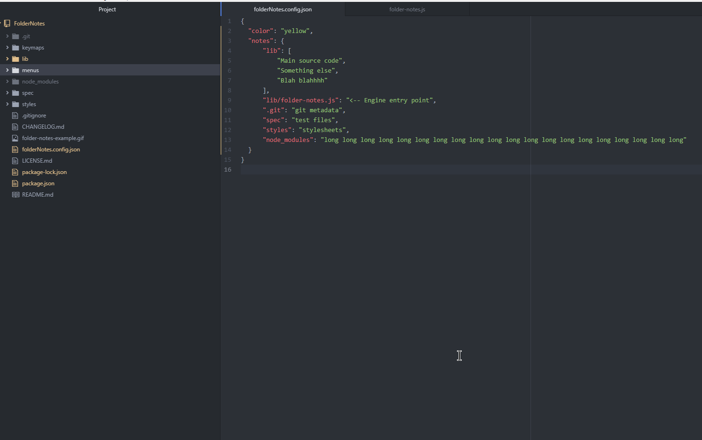

# folder-notes-enhanced package

Fork of https://github.com/Matthew-Carr/FolderNotes.git with added features

Lets you put notes on the file tree

## Instructions:
1. After installation, create a file named "folderNotesEnhanced.confignew.json" in your folder path
2. Create JSON object - {} - in config file
3. Right click folder/file to add notes

## Additional features from original:
- Multi-project support
- Labels
- Label and note editing dialogue

## Credits:
- Original project: https://github.com/Matthew-Carr/FolderNotes
- Automatic colour based on background: https://github.com/TetrisSmalls/AutoTextColor
